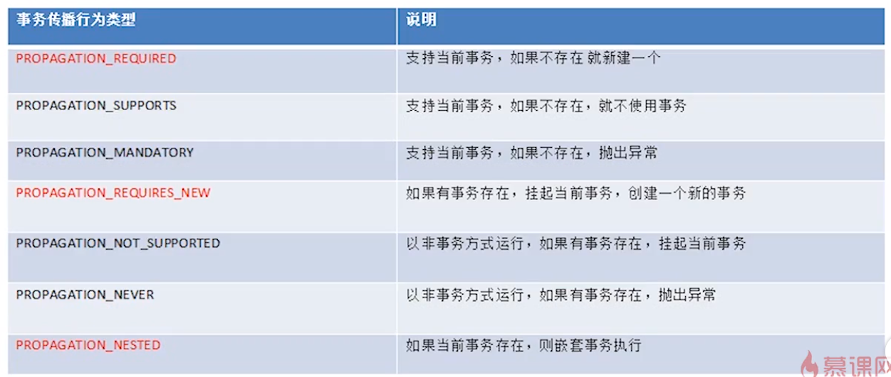

# Spring的事务管理

## 1、数据库事务

事务的ACID特性：原子性 隔离性 一致性 持久性

四种隔离界别：未提交读 提交读 可重复读 序列化

数据库事务类型有本地事务和分布式事务：

1. 本地事务：就是普通事务，能保证单台数据库上的操作的ACID，被限定在一台数据库上；
2. 分布式事务：涉及两个或多个数据库源的事务，即跨越多台同类或异类数据库的事务（由每台数据库的本地事务组成的），
分布式事务旨在保证这些本地事务的所有操作的ACID，使事务可以跨越多台数据库；

Java事务类型有JDBC事务和JTA事务：

1. JDBC事务：就是数据库事务类型中的本地事务，通过Connection对象的控制来管理事务；
2. JTA事务：JTA指Java事务API(Java Transaction API)，是Java EE数据库事务规范，JTA只提供了事务管理接口，
由应用程序服务器厂商（如WebSphere Application Server）提供实现，JTA事务比JDBC更强大，支持分布式事务。

Java EE事务类型有本地事务和全局事务：

1. 本地事务：使用JDBC编程实现事务；
2. 全局事务：由应用程序服务器提供，使用JTA事务；

按是否通过编程实现事务有声明式事务和编程式事务；

1. 声明式事务：通过注解或XML配置文件指定事务信息；
2. 编程式事务：通过编写代码实现事务。

## 2、Spring事务管理框架

### 2.1 依赖

使用Spring事务管理框架需要使用下面的依赖：

```
<dependency>
    <groupId>org.springframework</groupId>
    <artifactId>spring-tx</artifactId>
    <version>${spring.version}</version>
</dependency>
```

### 2.3 框架概述

#### 2.3.1 PlatformTransactionManager

该框架提供了事务策略，它是一个接口，定义如下：

```
public interface PlatformTransactionManager {
    TransactionStatus getTransaction(TransactionDefinition var1) throws TransactionException;
    void commit(TransactionStatus var1) throws TransactionException;
    void rollback(TransactionStatus var1) throws TransactionException;
}
```

针对每种具体的事务类型或者数据库类型，有不同的实现方式，实际的开发过程中要根据持久层的实现方式选择不同的事务管理器。


这里要注意：

1. 每个方法中都会抛出一个异常TransactionException，它是非受检异常，也就是继承自RuntimeException。
2. `getTransaction()`方法会根据传入的TransactionDefinition返回一个TransactionStatus。TransactionStatus代表一个事务，包含了事务的状态的信息。
3. TransactionDefinition接口则是用来指定事务的传播行为、隔离级别、超时和是否只读等信息的。
4. 最新版本的Spring事务管理器实现被分别集成到了不同的包中，需要根据使用的持久层引入不同的依赖。

#### 2.3.2 TransactionDefinition

该接口中定义了一组常量，我们将这些常量按照它们的名称（名称体现出功能）划分成下面几组:

组别1：事务的传播行为

    int PROPAGATION_REQUIRED = 0;
    int PROPAGATION_SUPPORTS = 1;
    int PROPAGATION_MANDATORY = 2;
    int PROPAGATION_REQUIRES_NEW = 3;
    int PROPAGATION_NOT_SUPPORTED = 4;
    int PROPAGATION_NEVER = 5;
    int PROPAGATION_NESTED = 6;

事务的传播行为主要用来解决业务层方法之间的调用的问题。就是说业务层的两个方法中分别具有不同的事务，此时该使用哪个事务或者事务该如何表现，就由传播行为来指定。

下面是事务的传播行为的基本总结：



事务的传播行为可以分为3组，每组我们只要记住被标记为红色的一个就可以了，因为该组中的行为传播行为是相似的。


组别2：事务的隔离级别
	
    int ISOLATION_DEFAULT = -1;
    int ISOLATION_READ_UNCOMMITTED = 1;
    int ISOLATION_READ_COMMITTED = 2;
    int ISOLATION_REPEATABLE_READ = 4;
    int ISOLATION_SERIALIZABLE = 8;
   
下面是关于事务的隔离级别的总结：


组别3：事务的超时信息
	
	int TIMEOUT_DEFAULT = -1;

此外该接口中还定义了一组方法，主要用来获取事务信息。

#### 2.3.3 TransactionStatus

该接口中定义了一些用于获取事务管理器状态的方法。

## 3、使用Spring事务管理

### 3.1 环境搭建

要测试Spring的事务管理，首先我们要搭建一个简单的开发环境。我们按照下面的步骤来进行。

这里我们使用DBCP连接池，所以要加入下面的依赖：

```
<dependency>
    <groupId>commons-dbcp</groupId>
    <artifactId>commons-dbcp</artifactId>
    <version>1.4</version>
</dependency>
```

我们使用MySQL进行测试，所以又需要使用MySQL连接驱动：

```
<dependency>
    <groupId>mysql</groupId>
    <artifactId>mysql-connector-java</artifactId>
    <version>5.1.38</version>
</dependency>
```

不论是使用声明式事务管理还是编程式事务管理，我们都需要先配置数据库源：

```
<!-- 加载配置文件 -->
<context:property-placeholder location="classpath:tx/dbcp.properties" />

<!-- 使用dbcp作为数据源 -->
<bean id="dataSource" class="org.apache.commons.dbcp.BasicDataSource" destroy-method="close">
    <property name="driverClassName" value="${jdbc.driverClassName}" />
    <property name="url" value="${jdbc.url}" />
    <property name="username" value="${username}" />
    <property name="password" value="${password}" />
</bean>
```

显然，这里用到了占位符。这些实际的数据是写在配置文件`dbcp.properties`里面的：

```
jdbc.driverClassName=org.gjt.mm.mysql.Driver
jdbc.url=jdbc:mysql://localhost:3306/spring_is_comming
username=root
password=qweasdzxc
```

针对Spring JDBC的事务，我们需要引入Spring-jdbc依赖：

```
<dependency>
    <groupId>org.springframework</groupId>
    <artifactId>spring-jdbc</artifactId>
    <version>${spring.version}</version>
</dependency>
```

这样我们就可以定义事务管理器：

```
<bean id="txManager" class="org.springframework.jdbc.datasource.DataSourceTransactionManager">
    <property name="dataSource" ref="dataSource"/>
</bean>
```

完成了上面的配置，我们就可以在代码中使用SPring事务来进行管理了。这里我们用一个简单的例子来测试我们的开发环境：

    public static void main(String...args) {
        ApplicationContext context = new ClassPathXmlApplicationContext("tx/TxConfig.xml");
        PlatformTransactionManager transactionManager = (PlatformTransactionManager) context.getBean("txManager");
        TransactionStatus transactionStatus = transactionManager.getTransaction(new DefaultTransactionDefinition());
        DataSource dataSource = (DataSource) context.getBean("dataSource");
        try {
            JdbcTemplate jdbcTemplate = new JdbcTemplate(dataSource);
            String sql = "update tx_change set money = money + 200 where id = 0";
            String sql2 = "update tx_change set money = money - 100 where id = 0";
            jdbcTemplate.update(sql);
            int x = 1/0;
            jdbcTemplate.update(sql2);
            transactionManager.commit(transactionStatus);
        } catch (Exception e) {
            e.printStackTrace();
            transactionManager.rollback(transactionStatus);
        }
    }

这里我们从上下文中获取数据源并使用JDBC模板来执行SQL，在SQL执行完毕之后中间产生一个异常，并在catch语句中捕获异常并进行事务的回滚。
最终因为事务被回滚，导致SQL没有成功执行。

以上Spring事务的实现方式是使用编程的方式来实现的，也就是说它用编写Java样板代码的方式来实现。

### 3.2 声明式事务管理

从上面的编程式事务管理中可以看出，使用Spring事务进行管理的时候有许多样板代码，这些方法在执行真正的逻辑之前和之后被调用，我们可以使用AOP来简化模板。

所谓声明式事务管理其实也就是使用AOP的思想，从一定程度上讲，也就是在复习Spring AOP相关的东西。

#### 3.2.1 使用TransactionProxyFactoryBean实现声明式事务管理

这种方式使用TransactionProxyFactoryBean来对我们的业务层的方法做代理，并在其中定义事务的行为以及对事务进行控制。

这里我们先定义DAO层：

```
public interface TXDAO {
    void addMoney();
    void minusMoney();
}
public class TXDAOImpl extends JdbcDaoSupport implements TXDAO {

    @Override
    public void addMoney() {
        String sql = "update tx_change set money = money + 200 where id = 0";
        getJdbcTemplate().update(sql);
    }

    @Override
    public void minusMoney() {
        String sql = "update tx_change set money = money - 100 where id = 0";
        getJdbcTemplate().update(sql);
    }
```

这里我们先定义了接口TXDAO，其中有addMoney()和minusMoney()两个方法。它们都用来对表tx_change的字段money进行修改。

然后，我们定义业务层的类，它们调用DAO层的方法：

```
public interface TXTestService {
    void updateMoney();
}
public class TXTestServiceImpl implements TXTestService {
    @Autowired
    private TXDAO txdao;

    @Override
    public void updateMoney() {
        txdao.addMoney();
        int x = 1 / 0;
        txdao.minusMoney();
    }
}
```

这里我们定义了业务层接口TXTestService，并实现了它。在实现类中调用了TXDAO中的两个方法，并在两次调用之间出现一个异常。
在使用事务管理的时候，我们将updateMoney()方法整体作为一个事务进行管理。也就是如果方法中出现了异常，那么方法整体中的事务都会被回滚。

接下来就是在XML中配置这些Bean，当然也可以在Java代码中进行配置：

```
    <!-- 加载配置文件 -->
    <context:property-placeholder location="classpath:tx/dbcp.properties" />

    <!-- 使用dbcp作为数据源 -->
    <bean id="dataSource" class="org.apache.commons.dbcp.BasicDataSource" destroy-method="close">
        <property name="driverClassName" value="${jdbc.driverClassName}" />
        <property name="url" value="${jdbc.url}" />
        <property name="username" value="root" />
        <property name="password" value="${password}" />
    </bean>

    <!--事务管理模型-->
    <bean id="txManager" class="org.springframework.jdbc.datasource.DataSourceTransactionManager">
        <property name="dataSource" ref="dataSource"/>
    </bean>

    <!--定义DAO-->
    <bean id="txDAO" class="me.shouheng.spring.tx.dao.TXDAOImpl">
        <property name="dataSource" ref="dataSource"/>
    </bean>

    <!--定义Service-->
    <bean id="txTestService" class="me.shouheng.spring.tx.service.TXTestServiceImpl"/>

    <!--定义代理-->
    <bean id="txTestServiceProxy" class="org.springframework.transaction.interceptor.TransactionProxyFactoryBean">
        <property name="target" ref="txTestService"/>
        <property name="transactionManager" ref="txManager"/>
        <property name="transactionAttributes">
            <props>
  <prop key="*">PROPAGATION_REQUIRED</prop>
            </props>
        </property>
    </bean>
```

这里在之前的基础之上先定义了DAO并将数据源作为字段注入，然后将DAO注入到Service中。我们重点关注一下这里的TransactionProxyFactoryBean的配置。

它首先用`target`属性指定了要被代理的对象，然后用`transactionManager`指定了事务管理对象，最后用`transactionAttributes`指定事务的属性。
在该属性中我们是使用`props`标签来指定的，你可以看下它的Setter方法的定义。

最后说一下每个`prop`标签的含义，这里的`key`用来指定方法，我们用`*`就表示所有的方法，而其中的`PROPAGATION_REQUIRED`用来指定事务的传播行为，
你也可以在这里指定隔离级别等信息。它的整体含义就是，对目标对象中的所有方法使用PROPAGATION_REQUIRED指定的传播行为。除了指定传播行为、隔离级别、是否只读等信息，
我们还可以指定出现那些异常时仍然提交事务和出现哪些异常的时候回滚事务。

完成了上面的配置，我们就可以使用单元测试来测试一下我们的事务：

```
@RunWith(SpringJUnit4ClassRunner.class)
@ContextConfiguration("classpath:tx/TxConfig2.xml")
public class TXTest2 {

    @Resource(name = "txTestServiceProxy")
    private TXTestService txTestService;

    @Test
    public void test() {
        txTestService.updateMoney();
    }
}
```

使用Spring的单元测试需要引入的两个包：

```
<dependency>
    <groupId>org.springframework</groupId>
    <artifactId>spring-test</artifactId>
    <version>${spring.version}</version>
</dependency>
<dependency>
    <groupId>junit</groupId>
    <artifactId>junit</artifactId>
    <version>4.12</version>
    <scope>compile</scope>
</dependency>
```

上面的测试即调用了我们的业务层的方法，根据实际的测试结果确实可以对事务进行正确的管理。
这里还要注意一下，我们向TXTest2中注入TXTestService的时候使用的是`txTestServiceProxy`，也就是用代理增强之后的Service。
而且这里的Service必须定义成接口，才能成功地将代理之后的值注入进去。
